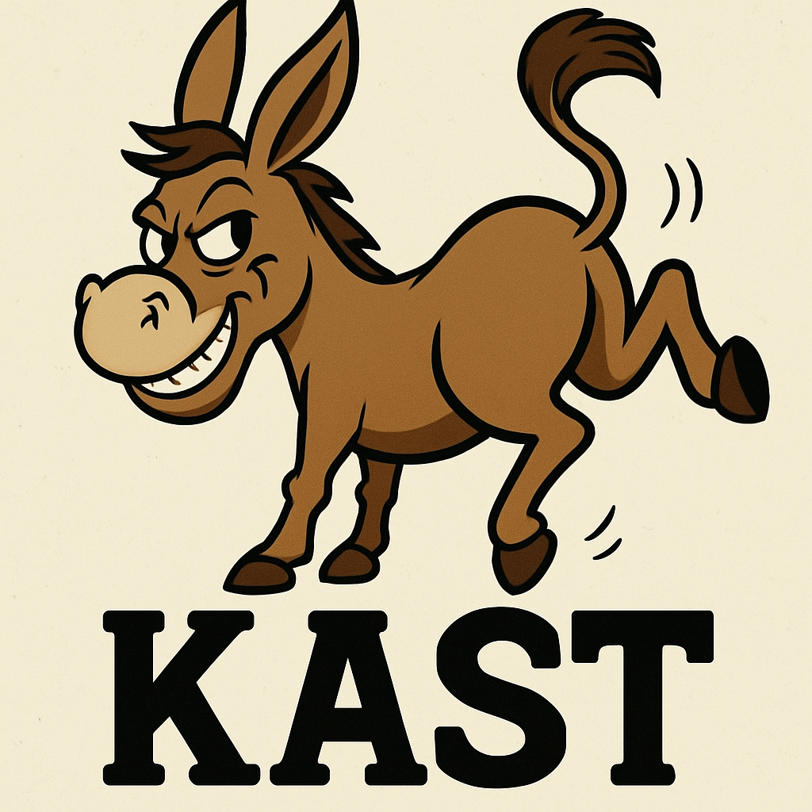

# KAST - Kali Automated Scan Tool

<p align="center">
  
</p>

**KAST** (Kali Automated Scan Tool) is a modular, extensible Python framework for automating web application security scanning tools. It orchestrates multiple security tools, aggregates their findings, and generates comprehensive HTML reports with executive summaries.

## 🌟 Key Features

### Core Capabilities
- **Modular Plugin Architecture**: Easily extend KAST with custom plugins for any security tool
- **Parallel Execution**: Run multiple security tools simultaneously for faster scans
- **Intelligent Report Generation**: Automatic HTML and PDF report generation with executive summaries
- **Flexible Execution Modes**: Support for both active and passive scanning modes
- **Report-Only Mode**: Generate reports from previously collected scan data
- **Dry Run Mode**: Preview scan execution without actually running tools
- **Selective Plugin Execution**: Run specific plugins using `--run-only`
- **Priority-Based Scheduling**: Plugins execute in order of priority for optimal workflow
- **Rich CLI Interface**: Beautiful terminal output with progress indicators using Rich library
- **Custom Logo Support**: Add your organization's logo to reports (PNG/JPG)

### Advanced Features
- **Issue Registry**: Centralized database of security issues with remediation guidance
- **Post-Processing Pipeline**: Structured JSON output with standardized format across all plugins
- **Execution Tracking**: Detailed timing information and execution metadata in `kast_info.json`
- **Redirect Detection**: Automatically identifies domain redirects and suggests additional scans
- **Custom HTML Styling**: Professional-looking reports with embedded CSS styling
- **Logging Infrastructure**: Comprehensive logging to both console and file

## 📦 Installation

### Prerequisites
- Python 3.7 or higher
- Kali Linux (recommended) or any Linux distribution
- Security scanning tools (see [Plugin Requirements](#-plugin-requirements))

### Quick Install

1. **Clone the repository:**
   ```bash
   git clone https://github.com/mercutioviz/kast.git
   cd kast
   ```

2. **Install Python dependencies:**
   ```bash
   pip install -r requirements.txt
   ```

   Required packages:
   
   **Core Web/HTTP Libraries:**
   - `aiohttp>=3.9.1` - Async HTTP client library
   - `requests>=2.31.0` - HTTP requests for plugins
   - `urllib3>=2.1.0` - HTTP library
   - `certifi>=2023.11.17` - Certificate bundle
   - `aioquic>=0.9.21` - QUIC/HTTP3 protocol support
   
   **HTML/Web Parsing:**
   - `beautifulsoup4>=4.12.2` - HTML parsing for plugins
   
   **CLI and Output:**
   - `rich>=13.7.0` - Terminal formatting and output
   - `psutil>=5.9.6` - System monitoring
   
   **Configuration and Templates:**
   - `pyyaml` - Configuration file parsing
   - `argparse` - Command-line argument parsing
   - `jinja2` - HTML template rendering
   
   **Report Generation:**
   - `weasyprint` - PDF report generation
   - `pillow` - Image processing for reports
   
   **Analysis and Processing:**
   - `scikit-learn>=1.3.0` - Machine learning library
   - `diskcache>=5.6.1` - Disk caching
   - `langdetect>=1.0.9` - Language detection
   
   **SSH and Remote Access:**
   - `paramiko>=3.0.0` - SSH protocol implementation for Python

3. **Install security tools:**
   
   On Kali Linux, most tools are pre-installed. For missing tools:
   ```bash
   sudo apt update
   sudo apt install whatweb wafw00f testssl.sh
   ```

   For additional tools:
   ```bash
   # Subfinder (subdomain enumeration)
   go install -v github.com/projectdiscovery/subfinder/v2/cmd/subfinder@latest
   
   # Katana (web crawler)
   go install github.com/projectdiscovery/katana/cmd/katana@latest
   ```

4. **Verify installation:**
   ```bash
   python -m kast.main --version
   python -m kast.main --list-plugins
   ```

## 🔄 Updating KAST

KAST includes a comprehensive update script for safely updating production installations.

### Quick Update

```bash
cd /path/to/kast/repo
git pull
sudo ./update.sh
```

### Update Features

- ✅ **Automatic Backups**: Creates timestamped backups before each update
- ✅ **Configuration Preservation**: Keeps your custom settings during updates
- ✅ **Easy Rollback**: Instantly restore any previous backup if issues occur
- ✅ **Version Tracking**: Tracks current and target versions
- ✅ **Validation**: Pre and post-update checks ensure system integrity
- ✅ **Multiple Modes**: Interactive, automated, and dry-run options

### Update Commands

```bash
# Interactive update (recommended)
sudo ./update.sh

# Automated update (for scripts/CI/CD)
sudo ./update.sh --auto

# Preview changes without modifying anything
sudo ./update.sh --dry-run

# List available backups
sudo ./update.sh --list-backups

# Rollback to previous version
sudo ./update.sh --rollback <timestamp>
```

### Documentation

- **Quick Reference**: [UPDATE.md](UPDATE.md)
- **Full Guide**: [kast/docs/UPDATE_SCRIPT_GUIDE.md](kast/docs/UPDATE_SCRIPT_GUIDE.md)

## 🚀 Usage

### Basic Syntax

```bash
python -m kast.main [OPTIONS] --target <domain>
```

### Common Commands

**Basic scan:**
```bash
python -m kast.main --target example.com
```

**Parallel execution for faster scans:**
```bash
python -m kast.main --target example.com --parallel --max-workers 5
```

**Run specific plugins only:**
```bash
python -m kast.main --target example.com --run-only whatweb,testssl,subfinder
```

**Active scan mode:**
```bash
python -m kast.main --target example.com --mode active
```

**Verbose output:**
```bash
python -m kast.main --target example.com --verbose
```

**Custom output directory:**
```bash
python -m kast.main --target example.com --output-dir ~/my-scans/example-scan
```

**Report-only mode (generate report from existing data):**
```bash
python -m kast.main --report-only ~/kast_results/example.com-20250119-143022/
```

**Dry run (preview without executing):**
```bash
python -m kast.main --target example.com --dry-run
```

**Generate PDF report:**
```bash
python -m kast.main --target example.com --format pdf
```

**Generate both HTML and PDF reports:**
```bash
python -m kast.main --target example.com --format both
```

**Use custom logo in reports:**
```bash
python -m kast.main --target example.com --logo ~/my-company-logo.png
```

### Command-Line Options

| Option | Description |
|--------|-------------|
| `-t, --target <domain>` | Target domain to scan (required) |
| `-m, --mode <mode>` | Scan mode: `active` or `passive` (default: passive) |
| `-p, --parallel` | Enable parallel execution of plugins |
| `--max-workers <n>` | Maximum parallel workers (default: 5) |
| `--run-only <plugins>` | Comma-separated list of plugins to run |
| `-o, --output-dir <path>` | Custom output directory |
| `--report-only <path>` | Generate report from existing scan data |
| `--format <format>` | Output format: `html`, `pdf`, or `both` (default: html) |
| `--logo <path>` | Custom logo file (PNG/JPG) for reports |
| `--dry-run` | Preview execution without running tools |
| `-v, --verbose` | Enable verbose logging |
| `-l, --log-dir <path>` | Log directory (default: /var/log/kast/) |
| `-ls, --list-plugins` | List all available plugins |
| `-V, --version` | Display version information |

## 🔌 Available Plugins

KAST includes the following built-in plugins:

| Plugin | Description | Type | Priority |
|--------|-------------|------|----------|
| **Script Detection** | Analyzes external JavaScript files and SRI protection | Passive | 10 |
| **WhatWeb** | Identifies web technologies and frameworks | Passive | 15 (High) |
| **Wafw00f** | Detects Web Application Firewalls (WAF) | Passive | 20 |
| **TestSSL** | Comprehensive SSL/TLS security testing | Passive | 30 |
| **Subfinder** | Subdomain enumeration and discovery | Passive | 40 |
| **FTAP** | Find The Admin Panel - Discovers exposed admin login pages | Active | 50 |
| **Katana** | Web crawling and endpoint discovery | Active | 50 |
| **Observatory** | Mozilla Observatory security assessment | Passive | 60 |

## 🛠️ Plugin Requirements

Each plugin requires its corresponding security tool to be installed:

### WhatWeb
- **Installation:** `sudo apt install whatweb`
- **Description:** Web technology fingerprinting
- **Homepage:** https://github.com/urbanadventurer/whatweb
- **Requirements:** Ruby

### Wafw00f
- **Installation:** `sudo apt install wafw00f` or `pip install wafw00f`
- **Description:** Web Application Firewall detection
- **Requirements:** Python 3

### TestSSL
- **Installation:** `sudo apt install testssl.sh`
- **Description:** SSL/TLS configuration testing
- **Homepage:** https://testssl.sh/
- **Requirements:** OpenSSL or LibreSSL, bash

### Subfinder
- **Installation:** 
  ```bash
  go install -v github.com/projectdiscovery/subfinder/v2/cmd/subfinder@latest
  ```
- **Description:** Fast passive subdomain enumeration
- **Homepage:** https://github.com/projectdiscovery/subfinder
- **Requirements:** Go 1.21+

### FTAP (Find The Admin Panel)
- **Installation:**
  ```bash
  pip install ftap
  ```
  Or from source:
  ```bash
  git clone https://github.com/DV64/Find-The-Admin-Panel.git
  cd Find-The-Admin-Panel
  pip install -r requirements.txt
  python setup.py install
  ```
- **Description:** Scans target websites for exposed admin login pages using stealth detection mode
- **Homepage:** https://github.com/DV64/Find-The-Admin-Panel
- **Requirements:** Python 3.7+
- **Features:**
  - Stealth detection mode for admin panel discovery
  - Confidence scoring for detected panels
  - Login form detection
  - Technology identification
  - JSON output format for integration

### Katana
- **Installation:**
  ```bash
  go install github.com/projectdiscovery/katana/cmd/katana@latest
  ```
- **Description:** Next-generation web crawler
- **Homepage:** https://github.com/projectdiscovery/katana
- **Requirements:** Go 1.21+

### Observatory
- **Installation:** Uses Mozilla's public API (no local installation required)
- **Description:** Security assessment using Mozilla Observatory
- **Homepage:** https://observatory.mozilla.org/
- **Requirements:** Internet connection

### Script Detection
- **Installation:** No external tool required (uses Python libraries)
- **Description:** Analyzes external JavaScript files and checks for Subresource Integrity (SRI) protection
- **Requirements:** Python packages: `requests`, `beautifulsoup4` (installed via requirements.txt)
- **Features:**
  - Detects cross-origin script loading
  - Identifies missing SRI protection
  - Correlates findings with Mozilla Observatory results
  - Highlights insecure (HTTP) external scripts

## 📊 Output Structure

KAST generates organized output in the following structure:

```
~/kast_results/example.com-20250119-143022/
├── kast_report.html           # Main HTML report
├── kast_report.pdf            # PDF report (if --format pdf or both)
├── kast_info.json            # Execution metadata and timing
├── whatweb.json              # Raw WhatWeb output
├── whatweb_processed.json    # Processed findings
├── testssl.json              # Raw TestSSL output
├── testssl_processed.json    # Processed findings
└── ...                       # Additional plugin outputs
```

### kast_info.json
Contains execution metadata including:
- KAST version
- Start/end timestamps
- Execution duration
- CLI arguments used
- Per-plugin timing information

### Reports (HTML and PDF)
The generated reports include:
- Executive summary with key findings
- Per-plugin detailed findings
- Security issues with remediation guidance
- Technology stack identification
- Visual styling for easy readability
- Custom logo support (if provided)
- Professional formatting optimized for each format

## 🌐 KAST Web Interface

For a web-based interface to KAST, check out the **KAST-Web** sister project:

**Repository:** https://github.com/mercutioviz/kast-web

KAST-Web provides:
- Web UI for initiating scans
- Real-time scan progress monitoring
- Interactive report viewing
- Historical scan management
- Multi-user support
- RESTful API for integration

## 🔧 Extending KAST

### Creating Custom Plugins

KAST's modular architecture makes it easy to add new security tools. See the [Plugin Development Guide](kast/plugins/README.md) for detailed instructions.

Quick steps:
1. Copy `kast/plugins/template_plugin.py`
2. Rename and customize the class
3. Implement required methods: `__init__`, `is_available`, `run`, `post_process`
4. Add your plugin to the plugins directory
5. Test with `--run-only your_plugin_name`

### Plugin Lifecycle
```
__init__() → is_available() → run() → post_process() → report generation
```

## 📝 Configuration

### Issue Registry
KAST includes a centralized issue registry at `kast/data/issue_registry.json` containing:
- Issue definitions and descriptions
- Severity ratings (Critical, High, Medium, Low, Informational)
- Remediation guidance (talking points)
- Categorization (HTTPS, Security Headers, Configuration, etc.)

Plugins can reference issues by ID for consistent reporting.

### Custom Styling
Customize report appearance by editing `kast/templates/kast_style.css`.

## 🐛 Troubleshooting

### Common Issues

**Plugin shows as unavailable:**
- Verify the tool is installed: `which <tool_name>`
- Check your PATH includes the tool's location
- Try reinstalling the tool

**Permission errors:**
- Ensure log directory is writable: `sudo chmod 666 /var/log/kast/`
- OR change owner: `sudo chown $USER:$USER /var/log/kast/`
- Use `--log-dir` to specify an alternative location

**Empty reports:**
- Check `kast_info.json` for execution errors
- Run with `--verbose` for detailed logging
- Verify the target is accessible

**SSL/TLS errors with TestSSL:**
- Ensure OpenSSL is properly installed
- Some scans may take several minutes on complex sites

## 📚 Additional Resources

### Documentation
- [Plugin Development Guide](kast/plugins/README.md)
- [Executive Summary Implementation](kast/docs/EXECUTIVE_SUMMARY_IMPLEMENTATION.md)
- [KAST Info Implementation](kast/docs/KAST_INFO_IMPLEMENTATION.md)
- [Parallel Execution Improvements](kast/docs/PARALLEL_EXECUTION_IMPROVEMENTS.md)
- [WhatWeb Redirect Detection](kast/docs/WHATWEB_REDIRECT_DETECTION.md)

### Directory Structure
```
kast/
├── __init__.py
├── main.py              # Entry point
├── orchestrator.py      # Plugin orchestration
├── report_builder.py    # HTML report generation
├── report_templates.py  # Report templates
├── utils.py            # Utility functions
├── config.py           # Configuration
├── plugins/            # Plugin implementations
│   ├── base.py
│   ├── whatweb_plugin.py
│   ├── testssl_plugin.py
│   └── ...
├── data/
│   └── issue_registry.json
├── templates/
│   ├── report_template.html
│   └── kast_style.css
├── tests/              # Test suite
└── docs/              # Documentation
```

## 🤝 Contributing

Contributions are welcome! Please:
1. Fork the repository
2. Create a feature branch
3. Write tests for new functionality
4. Submit a pull request

For plugin contributions, ensure:
- Code follows existing style conventions
- Plugin includes comprehensive docstrings
- Post-processing generates standardized JSON
- Testing covers both unit and integration scenarios

## 📄 License

This project is licensed under the MIT License - see the [LICENSE](LICENSE) file for details.

## 🙏 Acknowledgments

KAST integrates and orchestrates excellent open-source security tools:
- WhatWeb by Andrew Horton
- Wafw00f by Sandro Gauci
- TestSSL by Dirk Wetter
- Subfinder by ProjectDiscovery
- Katana by ProjectDiscovery
- Mozilla Observatory

## 📞 Support

For issues, questions, or feature requests:
- GitHub Issues: [Create an issue](https://github.com/mercutioviz/kast/issues)
- Documentation: Check the `docs/` directory
- Plugin Development: See `kast/plugins/README.md`

---

**Version:** 2.6.2
**Last Updated:** December 2024

Made with ❤️ for the security community
