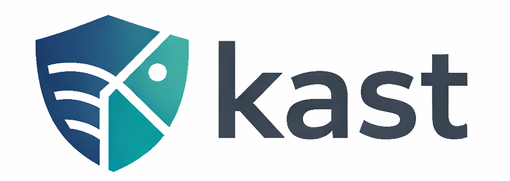

# KAST — Kali Automated Scan Tool

<p align="center">
  
</p>

KAST is a modular Python framework that orchestrates web-application security scanning tools, aggregates their findings, and produces digestible HTML and PDF reports with executive summaries — including an optional AI-augmented narrative powered by Claude.

KAST pairs with **kast-web**, a Flask web frontend that lets a team submit scans through a browser and manage cloud infrastructure for ephemeral ZAP scanning. The two ship as a coordinated bundle: kast 3.0 + kast-web 2.0.

---

## What's new in v3

- **Click-based subcommand CLI** (`kast scan`, `kast plugins`, `kast registry`, `kast doctor`, `kast self-update`, `kast config`). The legacy v2 argv shape (`kast --target X --mode passive ...`) still works through a compatibility wrapper.
- **AI-augmented executive summaries.** `kast scan --ai-summary` produces a narrative, key findings, and recommended actions via Claude. Set `KAST_AI_API_KEY` or configure `~/.config/kast/ai.yaml`.
- **Unified report pipeline.** One data structure feeds both the HTML and PDF renderers, eliminating drift between them.
- **PluginRegistry** and **`ExternalToolPlugin`** base — clean plugin authoring with class-attribute identity and shared subprocess scaffolding.
- **Atomic JSON writes** for every state-bearing file — kast-web watchers never observe a partial file.
- **Issue-registry workflow:** `kast registry list / add / promote SCAN_DIR` to surface and accept new issue IDs from scan output.
- **Cloud-deployment subsystem moved to kast-web.** kast 3.0 only handles `local` and `remote` ZAP modes; cloud-mode scans are managed by kast-web.

For the full migration story, see [`docs/MIGRATION_V2_TO_V3.md`](docs/MIGRATION_V2_TO_V3.md). For the rationale behind the refactor, see [`docs/v3-planning/`](docs/v3-planning/).

---

## Features

**Core capabilities**
- Modular plugin architecture for any external scanner
- Sequential or parallel execution with dependency resolution
- HTML and PDF reports with executive summary, severity breakdown, and WAF impact analysis
- AI-augmented executive summaries (opt-in)
- Active and passive scanning modes
- Report-only mode (`kast scan rerun DIR`) regenerates reports from existing scan data
- Dry-run mode previews execution without running tools
- Selective plugin execution (`--run-only`)
- Priority-based plugin scheduling
- Custom logo support for white-labeled reports

**Operations**
- Issue registry with severity / category / talking points
- Atomic per-plugin output (`*.json` and `*_processed.json`) for safe consumption by external watchers
- Detailed timing in `kast_info.json`
- Comprehensive logging to console and file
- `kast doctor` for environment health checks (with `--fix` for safe auto-remediation)
- `kast self-update` for in-place upgrades with backups and rollback

---

## Installation

### Prerequisites

**Operating system:** Debian 12/13 or Ubuntu 24.04 (recommended for clean installs); Kali Linux 2024.x or later (also supported).

**System requirements:** Python 3.11+, APT package manager (Debian-based systems), root access for the installer, internet connection for downloads.

### Option 1: pipx (recommended for kast-only use)

If you only need the kast CLI (no kast-web), install via pipx:

```bash
pipx install kast
kast doctor --fix
kast --version
```

`kast doctor --fix` creates the results directory, scaffolds a default config, and prints any remaining external-tool installs you need to do by hand (e.g., `sudo apt install whatweb wafw00f testssl.sh`).

### Option 2: Automated installer (recommended for SA / production use)

The automated installer handles every dependency — Python, scanner CLIs, Go-installed tools, Docker, fonts for PDF rendering, system services. Use this when you want a clean kast install on a fresh box, especially if you'll also be running kast-web.

```bash
git clone https://github.com/mercutioviz/kast.git
cd kast
sudo ./install.sh
```

The installer will:
- Validate your OS and version
- Install Python, Go, Node.js as needed
- Install scanner tools (whatweb, wafw00f, testssl.sh, sslscan, subfinder, katana, ftap, observatory)
- Set up the kast Python venv and install the wheel
- Install Docker (for ZAP local mode)
- Create the system-wide `kast` launcher

Useful flags:
```bash
sudo ./install.sh --check-tools    # update tool binaries only
sudo ./install.sh --auto           # non-interactive (CI-friendly)
sudo ./install.sh --install-dir /custom/path
```

### Option 3: Docker

Build the image:
```bash
docker build -t kast:3.0.0 -t kast:latest .
```

Run a passive scan:
```bash
docker run --rm \
  -v "$HOME/kast_results:/kast_results" \
  -v "$HOME/.config/kast:/home/kast/.config/kast:ro" \
  kast:latest scan --target example.com --output-dir /kast_results
```

The image bundles `whatweb`, `wafw00f`, `testssl.sh`, `sslscan`, plus the Python runtime. ZAP is **not** bundled — for local-mode ZAP, mount `/var/run/docker.sock` and rely on the host's Docker daemon. For managed cloud-mode scans, use kast-web instead of running kast directly.

### Option 4: Manual install

For development or unusual environments:
```bash
git clone https://github.com/mercutioviz/kast.git
cd kast
python3.11 -m venv .venv
source .venv/bin/activate
pip install -e ".[dev]"
kast doctor
```

---

## Usage

### Basic scan

```bash
kast scan --target example.com
```

This runs every available plugin in passive mode and writes HTML+PDF reports plus per-plugin JSON to `~/kast_results/example.com-YYYYMMDD-HHMMSS/`.

### Common scan options

```bash
# Active mode (includes ZAP)
kast scan --target example.com --mode active

# Specific plugins only
kast scan --target example.com --run-only whatweb,wafw00f,testssl

# Parallel execution
kast scan --target example.com --parallel --max-workers 5

# Dry-run preview (don't actually scan)
kast scan --target example.com --dry-run

# AI-augmented executive summary
kast scan --target example.com --ai-summary

# Custom output directory and logo
kast scan --target example.com --output-dir /tmp/scan1 --logo my-logo.png

# Override a plugin config knob
kast scan --target example.com --set related_sites.httpx_rate_limit=20
```

### Past scans

```bash
kast scan list                     # list past scans under ~/kast_results
kast scan show DIR                 # show details of a past scan
kast scan rerun DIR                # re-render reports from existing data
```

### Plugins, registry, doctor

```bash
kast plugins list                  # list discovered plugins (--json available)
kast plugins show whatweb          # show config schema and metadata
kast plugins deps                  # plugin dependency tree

kast registry list                 # list issue-registry entries
kast registry add ID --severity High --category Headers ...
kast registry promote SCAN_DIR     # walk through missing_issue_ids.json

kast doctor                        # environment health check
kast doctor --fix                  # apply safe auto-fixes
kast doctor --json                 # machine-readable
```

### Configuration

Plugin and global settings are managed via YAML, with priority: CLI overrides > project config > user config > system config > schema defaults.

```bash
kast config init                   # write a default config
kast config show                   # show merged config
kast config schema                 # export the JSON schema
```

Configs are searched at `./kast_config.yaml`, `~/.config/kast/config.yaml`, and `/etc/kast/config.yaml`.

### AI-augmented summaries

When `--ai-summary` is set, kast calls Claude (via the Anthropic API) with the scan's findings and produces a structured executive summary. Configure credentials by either setting the env var:

```bash
export KAST_AI_API_KEY=sk-ant-...
```

or writing `~/.config/kast/ai.yaml`:

```yaml
provider: anthropic
api_key: sk-ant-...
model: claude-sonnet-4-6
```

If the AI call fails (no key, network error, schema mismatch), the report still generates with a deterministic summary and a banner noting the issue. You always get a report.

---

## Plugins (v3.0)

| Plugin                  | Display Name              | Type    | Priority | Description                              |
| ----------------------- | ------------------------- | ------- | -------- | ---------------------------------------- |
| `org_discovery`         | Organization Discovery    | Passive | 3        | WHOIS / Shodan correlation               |
| `mozilla_observatory`   | Mozilla Observatory       | Passive | 5        | Security headers and HTTPS posture       |
| `script_detection`      | External Script Detection | Passive | 10       | Third-party script inventory             |
| `subfinder`             | Subfinder                 | Passive | 10       | Subdomain enumeration                    |
| `wafw00f`               | Wafw00f                   | Passive | 10       | WAF detection                            |
| `whatweb`               | WhatWeb                   | Passive | 15       | Technology fingerprinting                |
| `related_sites`         | Related Sites Discovery   | Passive | 45       | Affiliated-domain risk surface           |
| `ftap`                  | Find The Admin Panel      | Passive | 50       | Admin-panel discovery                    |
| `testssl`               | Test SSL                  | Passive | 50       | TLS configuration audit                  |
| `katana`                | Katana                    | Passive | 60       | Web crawler                              |
| `ai_chatbot_detection`  | AI Chatbot Detection      | Passive | 70       | LLM widget detection                     |
| `zap`                   | OWASP ZAP                 | Active  | 200      | Active vulnerability scanner             |

Lower priority numbers run earlier. ZAP supports two execution modes: `local` (Docker-based) and `remote` (connect to an existing ZAP via SSH+API). Cloud-mode ZAP is managed by kast-web.

---

## Output structure

```
~/kast_results/example.com-20260502-143022/
  kast_report.html
  kast_report.pdf
  kast_info.json              (scan metadata + AI block)
  kast_style.css
  missing_issue_ids.json      (if any IDs were unrecognized)
  zap_scan_progress.json      (during/after ZAP scans)
  {plugin}.json               (raw tool output)
  {plugin}_processed.json     (post-processed; consumed by kast-web)
```

Every state-bearing file is written atomically (write to `.tmp`, then `os.replace`) — external watchers never observe partial writes.

---

## Updating

```bash
kast self-update                   # update in place; backups + rollback
kast self-update --check-only      # see what would change
kast self-update --rollback TS     # restore a prior backup
```

For installer-based installs:
```bash
cd /path/to/kast-repo
git pull
sudo ./update.sh
```

---

## Plugin development

See [`kast/plugins/README.md`](kast/plugins/README.md) for the full plugin authoring guide, and [`genai-instructions.md`](genai-instructions.md) for v3 patterns. The short version:

- Inherit from `ExternalToolPlugin` for tool wrappers; from `KastPlugin` for pure-Python plugins.
- Declare identity (`name`, `display_name`, `description`, `website_url`, `scan_type`, `output_type`) as **class attributes** — never set in `__init__`.
- Declare `config_schema` as a class attribute too.
- Required hooks: `build_command(target, output_path)`, `count_findings(findings)`. Optional hooks have sensible defaults: `parse_findings`, `extract_issues`, `format_summary`, `format_details`, `format_executive_summary`, `extra_processed_fields`.
- Use `self.get_config(key, default)` to read plugin configuration.
- Use `kast.core.atomic.write_json_atomic` for any state-bearing JSON writes.
- Use the `Severity` enum (`kast.core.severity`) for severity values; never bare strings.

---

## kast-web

For multi-user / browser-based scanning and managed cloud-mode ZAP, see the [kast-web companion repo](https://github.com/mercutioviz/kast-web). It shells out to the kast CLI and adds:

- Web-based scan submission and history
- User accounts, roles, and audit logging
- Cloud-mode ZAP scanning via Terraform-provisioned ephemeral infrastructure (AWS / Azure / GCP)
- Encrypted credential storage for cloud providers
- Polished report sharing and download

The kast↔kast-web boundary is documented in [`docs/web-integration.md`](docs/web-integration.md).

---

## Contributing

For issues, questions, or feature requests:
- GitHub Issues: [Create an issue](https://github.com/mercutioviz/kast/issues)
- Documentation: see `docs/` and `genai-instructions.md`
- Plugin authoring: see `kast/plugins/README.md`

---

## License

MIT. See [`LICENSE`](LICENSE).
